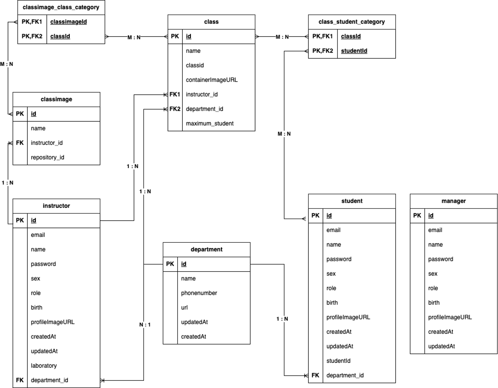
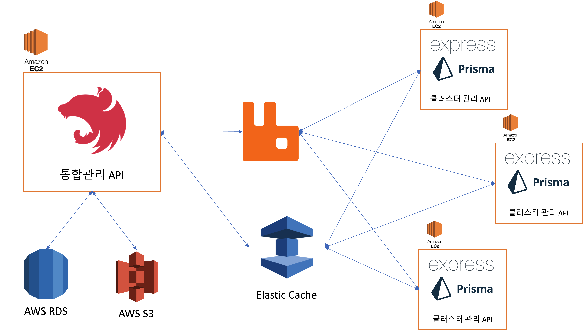

# 백엔드와 아키텍쳐의 재설계

작성일 : 2023년 07월 28일

작성자 : 윤준호

tag : Backend, Monolithic, Message Queue, MSA

---

## 1. 1학기동안 구현한것을 갈아엎었다

이제 막학년이다. 그리고 막학년을 마무리하기 위해서는 캡스톤 디자인,(이라 하고 졸업작품이라 읽는다)을 진행해야한다. 현재 팀은 2명으로 이루어져있으며, 필자는 Backend, Infra, Network, DB 설계 및 구현 담당이다. 할꺼 많아보인다고 생각했다면 잘 본것이다.1학기때 진행됐던 진행사항들은 아래와 같다

- 주제 선정
- 아키텍쳐 설계
- 백엔드 및 DB설계
- API 개발

1학기가 종료됐을때 API도 전반적인 설계 중 대략 70% 개발이 끝난 상태였다. API를 구성하는 요소들은 아래와 같다

- TypeScript
- Nest.js
- MongoDB
- Redis
- Docker,(& Compose)

사실 Nest.js라는 프레임워크를 공부하고 사용하는 실질적인 첫 프로젝트였으며 API를 구현하는 시점에도 남은 공부를 하고 있는 상황이었다. 종강을 하고 API전반적인 코드와 데이터베이스 설계에 대해 셀프 리뷰를 진행했다. 처음에 API를 작성할때는 몰랐지만 숙련도가 어느정도 올라오고 전반적인 디자인 패턴(DI, AOP등등)과 Nest.js 기능들에 대한 응용력이 잡히니 잘못 설계한 모듈들이 보였으며, 잠재적인Circular Dependency등 안티패턴이 많이 보이기 시작하였다. 이것이 시작된 근본적인 원인은 데이터베이스 설계에서부터였다.

### 잘못된 DB 설계와 정규화

1학기 최종발표시 공개한 ERD는 아래와 같이 생겼다.



현재 API에서 Member는 세가지 Role을 가질 수 있다.

- Instructor
- Manager
- Student

사실 위 ERD를 처음 설계시 세개를 분리하는것에 대한 잠재적 우려가 있었다. 물론 분리한다고 문제될것은 없다. 일반적으로 간단한 LMS(Lecture Management System)을 구현한다 했을때도 교사와 학생 테이블을 구분하는것이 대표적인 예시이기 떄문이다.하지만 우려했던점은 불필요하게 비슷한 로직이 반복될 수 있다는 점과 모듈간의 상호 의존도가 높아질것이 우려되었다.

또한 개인적으로 위 설계에서 아쉬웠던점은 아무런 연관관계를 맺지않는 manager테이블이 단독으로 존재한다는 점과 Student, Instructor테이블이 1,2개를 제외한 변수들이 중복된 변수였고 Manager테이블도 중복되는 변수들이 많았다. 중복되는 변수가 많지만 분리되어있다는것은 결국 비즈니스 로직에서 중복되는 로직이 많아진다는점과 Role과 상관없이 회원과 관련된 로직에서는 모듈 의존성 혹은 레포지토리 의존성은 높아질 수 밖에없다.

어느정도의 의존성은 괜찮지만, 불필요한 의존성 상승은 테스팅 뿐만 아니라, 디버깅에도 어려움을 준다.(단일 책임 원칙에 위배된다.) 그렇기에 문제점들을 분석하고, 상호 의존성을 낮추면서 모든 연관관계를 보존할 수 있는 방법을 찾고자 했다.

### 문제점1. 인증과 인가

가장 문제가 되었던것은 인증과 인가 구현할때 문제가 되었다. API는 내부적으로 Request Handler에 대해 RBAC(Role Base Access Control)인가 로직이 구현되어있다. 이는 Nest.js의 Guard를 통해 구현되어있다. Guard는 Route Handler에 Request가 전달되기 전에 실행되며 Request를 받아도 되는지의 여부를 검사한다.Guard를 이용하면 RBAC뿐만 아니라 JWT Token에 대한 검증과 같은 자격증명 로직을 Decorator형태로 사용할 수 있다. 자세한건 Document를 참고하자.([Document](https://docs.nestjs.com/guards))

또한 로그인의 경우에는 세가지 Role이 하나의 API를 통한 로그인을 할 수 있도록 구현하고자 했다. 이 세가지 Role을 분리하고, 각각의 모듈을 분리하니까 아래와 같이 높은 의존성을 가지게 되는 문제점이 발생했고, 그와 동시에 로직도 복잡해지고, 당연히 스파게티 코드화가 되었다.

< AuthGuard >

```TypeScript
@Injectable()
export class AuthGuard implements CanActivate {
  constructor(
    private readonly jwtService: JwtService,
    @Inject(jwtConfig.KEY)
    private readonly jwtSettings: ConfigType<typeof jwtConfig>,
    @InjectRepository(StudentEntity)
    private readonly studentRepository: Repository<StudentEntity>,
    @InjectRepository(InstructorEntity)
    private readonly instructorRepository: Repository<InstructorEntity>,
    @InjectRepository(ManagerEntity)
    private readonly managerRepository: Repository<ManagerEntity>,
  ) { }

  ...
```

< AuthService >

```TypeScript
@Injectable()
export class AuthService {

  constructor(
    private readonly jwtService: JwtService,
    @Inject(jwtConfig.KEY)
    private readonly jwtSetting: ConfigType<typeof jwtConfig>,
    private readonly instructorService: InstructorService,
    private readonly studentService: StudentService,
    private readonly memberService: MembersService,
    private readonly managerService: ManagerService,
    @InjectRepository(StudentEntity)
    private readonly studentRepository: Repository<StudentEntity>,
    @InjectRepository(InstructorEntity)
    private readonly instructorRepository: Repository<InstructorEntity>,
    @InjectRepository(ManagerEntity)
    private readonly managerRepository: Repository<ManagerEntity>,
  ) { }

  public async login(
    body: LoginRequest,
    res: Response,
  ): Promise<TokenResponse> {
    const { email, password, role } = body;

    let selectiveServiceResult:
      | StudentProfileResponse
      | InstructorProfileRepsonse
      | ManagerProfileResponse;
    if (role === Role.STUDENT) {
      selectiveServiceResult = await this.studentService.getStudentByEmail(
        email,
      );
    } else if (role === Role.INSTRUCTOR) {
      selectiveServiceResult =
        await this.instructorService.getInstructorByEmail(email);
    } else if (role === Role.MANAGER) {
      selectiveServiceResult = await this.managerService.getManagerByEmail(
        email,
      );
    } else {
      throw new UnconfirmedRole();
    }

    // Varaibles for payload and password
    const memberPassword = selectiveServiceResult.password;
    const memberId = selectiveServiceResult.id;
    const memberRole = selectiveServiceResult.role;

    // Password validation
    await this.memberService.validatePassword(password, memberPassword);

    const payload: JwtPayload = {
      user_id: memberId,
      user_role: memberRole,
    };
    // Token generation
    const [accessToken, refreshToken] = await Promise.all([
      this.generateAccessToken(payload),
      this.generateRefreshToken(payload),
    ]);

    res.cookie(this.cookieRefreshKey, refreshToken, this.refreshCookieOption);

    return new TokenResponse(accessToken);
  }

  public async join(body: JoinRequest): Promise<JoinResponse> {
    // Check Role of Body
    const { role } = body;
    body.password = await this.memberService.hashPassword(body.password);
    let result: JoinResponse;
    if (role === Role.STUDENT) {
      result = await this.studentService.createStudent(body);
    } else if (role === Role.INSTRUCTOR) {
      result = await this.instructorService.createInstructor(body);
    } else if (role === Role.MANAGER) {
      result = await this.managerService.createManager(body);
    } else {
      throw new UnconfirmedRole();
    }
    return result;
  }
    ...
```

사실 API를 작성하면서도 의아했던 부분들이었다. 로그인은 AuthService에서 처리하는 반면, 회원가입은 각각의 Service에서 하고있었으니 말이다. 당연히 이 스노우볼은 모든 API에 영향을 미쳤고(이후 할말이 많지만... 하지않겠다.), 유지보수하기에는 너무 난해하다 판단하였다.

### 문제점 2. 프레임워크와 타입스크립트에 대한 낮은 숙련도와 잡혀있지 않은 테스트 사이클

위에서 봤듯이 설계적인 문제도 있었지만, 학습한지 얼마 안된 프레임워크였기에 숙련도 문제도 큰 영향을 끼쳤다. 또한 불안정한 타입스크립트 숙련도도 한몫했다. 그도 그럴것이 타입스크립트를 실제로 학습한것은 작년 12월 말부터였으며, Nest.js는 1월 말부터 사용하였기 때문이다.(러닝커브 이슈, 또한 필자는 이 글을 쓰고 있는 현재 백엔드 공부를 시작한지 아직 1년 조금 넘은 상황이며 Node.js를 사용한지는 딱 1년되었다. 학습속도를 급격히 올리다 보니 백엔드 숙련도에서 미숙한 부분들이 스스로도 많이 보인다.). 특정 부분을 잡아서 설명하기는 어렵지만, 전반적인 소스코드에서 상황에 따른 타입스크립트 장점을 활용하지 못한 부분이 크다. 또한 Custom Type을 정의하는 부분에서도 Utility Type들을 적절히 활용하지 못했으며, Generic 기반 타입 설계측면에서도 부족한점이 보였다.

숙련도 문제가 들고온 가장 큰 문제는 테스트와 관련된 것이었다. 기존에 사용하던 Express는 자율성이 높고, 사용자가 대부분 정의를 해서 프로젝트를 구성해야하기에 테스트 하기가 비교적 쉬웠다. 하지만 Nest.js는 말이 다르다. 기본적으로 제공하는 프레임워크 내부적인 기능을 활용하고, DI Container에 의해 의존성이 주입되며 무엇보다 TypeORM이라는 ORM은 처음 사용해봤다. 테스트를 위해 어떤 방식을 취해야하는지 찾아봤지만, 대부분 꼼수를 활용하는 방법이 많았고, 내가 원하던 방식의 테스트 사이클이 적용된 글을 찾지 못했다.

결론적으로 테스트 코드 감이 오지 않아 E2E + Mocking + Unit이라는 끔찍한 혼종 방식의 테스트를 진행했다.

당연히 Database연동과 관련된 부분은 제대로 테스트 해보지도 못하고 Coverage는 대략 90%가 나왔지만, 코드 신뢰성이 매우 떨어지는 테스트 코드였다. 테스트 코드를 통해서 잡지 못한 예외에 대한 처리를 해야하지만, 그 과정 또한 이루어지지 못했다.(결국 코드의 신뢰도와 품질은 매우 낮아졌다.)

```TypeScript

이게 뭐누....

describe('E2E Scenario2 : Enroll new Manager', () => {
  let app: INestApplication;
  let newManager: ManagerEntity;
  const mockManager: ManagerCreateDto = {
    email: 'manager2@gmail.com',
    name: 'manager',
    password: 'password',
    sex: Sex.MALE,
    role: Role.MANAGER,
    birth: new Date(),
    profileImageURL: 'URL',
  };
  const changedManagerName = 'changedManagerName';
  const changedManagerPassword = 'changedpassword';
  let mockManagerToken: string;

  beforeAll(async () => {
    const moduleRef = await Test.createTestingModule({
      imports: [AppModule],
    }).compile();

    app = moduleRef.createNestApplication();
    await app.init();
  });

  afterAll(async () => {
    app.close();
  });

  describe('Create Manager', () => {
    it('POST /auth/join', async () => {
      /**
       * Set header : Accept, application/json
       *
       */
      const response = await request(app.getHttpServer())
        .post('/auth/join')
        .set('Accept', 'application/json')
        .send(mockManager);
      expect(response.status).toEqual(201);
      expect(response.body.email).toEqual(mockManager.email);
      newManager = response.body;
    });
  });

  describe('Get Manager', () => {
    it('GET /manager/:id', async () => {
      const response = await request(app.getHttpServer()).get(
        `/manager/${newManager.id}`,
      );
      expect(response.status).toEqual(200);
      expect(response.body.email).toEqual(newManager.email);
    });
  });

  describe('Modify Manager', () => {
    it('POST /auth/login', async () => {
      const loginReq: LoginReque
```

### 해결0. 그냥 엎자

결론은 시간 아까울수있지만, 스스로 숙련도에 대한 강화와 시간이 걸리더라도 제대로된 개발 사이클을 적용하고자 했다.

### 해결1. DataBase 재설계

가장 먼저 한것은 데이터베이스에 대한 재설계이다. 재설계한 ERD는 아래와 같다


당연히 재설계에 중점을 둔것은 회원에 대한 것이다. 우선 Manager, Student, Instructor 각각의 중복되는 변수를 묶에 Member 테이블로 둔 후, Student, Instructor는 각각의 Role에 대한 연관관계가 요구되기 때문에 student_profile, instructor_profile(둘다 nullable) 변수를 두어 각 Member의 역할에 따른 접근을 할 수 있도록 변경했다.

위와 같이 변경하고 난 후, 불필요한 레포지토리 의존도 뿐만 아니라, 모듈간 책임 분리도 확실히 할 수 있었으며, 인증과 인가에서도 불필요한 의존도를 없앨 수 있게 되었다. 가장 대표적으로 JWTGuard(위의 AuthGuard와 동일)를 보자.

```TypeScript
@Injectable()
export class JwtStrategy extends PassportStrategy(Strategy) {
  constructor(
    @InjectRepository(MemberEntity)
    private readonly memberRepository: Repository<MemberEntity>,
    @Inject(jwtConfig.KEY)
    private readonly jwtConf: ConfigType<typeof jwtConfig>,
  ) {
    super({
      jwtFromRequest: ExtractJwt.fromAuthHeaderAsBearerToken(),
      ignoreExpiration: false,
      secretOrKey: jwtConf.secret,
    });
  }
```

기존에는 레포지토리 의존도가 높았지만, 순수 회원에 대한 검증은 Member 테이블 안에서 모두 끝낼 수 있기에, 의존도가 Member Repository외에 없는것을 볼 수 있다.(Config 제외) 당연히 분기문의 빈도도 줄어들었으며, 코드도 훨씬 깔끔해졌다.

## 해결2. 테스트 사이클 적용

이제는 프레임워크 자체에 대한 숙련도가 많이 올라온 상태이다. 그렇기에 전반적인 해결과정이 모두 보이기 시작했다. 개발 과정을 생략하고 테스트 사이클에 대해 이야기를 하고자 한다. 앞에서 진행한 테스트는 신뢰성이 낮기에 틀린 테스트를 한것이다. 테스트 사이클에는 정석적인 테스트 사이클을 적용하기로 했으며, 현재 프로젝트에서 적용한 테스트 사이클은 아래와 같다.


가장 먼저 도입한것은 [`testingcontainers`](https://testcontainers.com/)이다. 해당 오픈소스는 테스트용 DB를 테스트 시작시 생성하고 테스트가 끝나면 컨테이너를 자동으로 삭제해주는 기능을 가지고 있다. Testing Container는 현재 Service를 테스트하는 Unit Test코드에 적용된 상태이며, 추후 통합테스트 시에도 같이 활용할 예정이다. 테스트 DB를 일일히 구축해주는 번거로움이 줄어든것이다. 또한 이를 활용하면 TypeORM과 Database Transaction을 테스트하기에도 훨씬 용이하다. 아래 코드는 testingcontainers를 활용한 테스트코드 준비과정이다.

```TypeScript
describe('MemberService', () => {
  jest.setTimeout(300000);
  let service: MemberService;

  //Set test database container
  let container: StartedMySqlContainer;
  // DataSource
  let dataSource: DataSource;

  beforeAll(async () => {
    container = await new MySqlContainer().start();
    dataSource = await new DataSource({
      type: 'mysql',
      host: container.getHost(),
      port: container.getPort(),
      database: container.getDatabase(),
      username: container.getUsername(),
      password: container.getUserPassword(),
      synchronize: true,
      entities: [`${__dirname}/../../**/*.entity{.ts,.js}`],
    }).initialize();

    // Mock department enttiy findone as always true
    jest
      .spyOn(dataSource.getRepository(DepartmentEntity), 'findOneBy')
      .mockImplementation(async () => {
        return {} as DepartmentEntity;
      });
  });
```

Mocking, Unit Test에서는 Jest프레임워크를 사용하였으며 E2E에는 Supertest 그리고 아직 진행하지 않았지만, Stress Test에는 K6와 Grafana를 연계하여 사용할 예정이다. 현재 이 API의 Coverage는 94.77%로 양호한 편이다.

API 재설계, 재구현, 테스트까지 대략 2주 반에서 3주정도 시간이 걸린것같다. 한번더 느낀것은 테스트코드의 중요성이다. 테스트 코드는 결코 올바르게 동작하는 상황만 생각하지 않는다. 오류가 나는 상황에 대한 생각도 해야되며 테스트 해야한다. 이 과정에서 못잡은 예외를 많이 처리할 수 있었으며, 소스코드 자체에 대한 최적화와 Controller, Service간의 단일 책임과 독립성을 구체적으로 보이도록 적용할 수 있었다. 예전에 김영한님의 스프링 강의를 들을때 하신 말씀이 떠오른다

> > 제대로 작성된 코드는 해당 함수 혹은 단위별로 테스트가 가능해야한다.

## Monolithic Architecture에서 Micro Service Architecture로의 변환

종합설계 주제가 주제인만큼, 사용자가 정의한대로 Dockerfile을 빌드하고 Docker Private Registry(Harbor사용)에 올리는 과정이 있고, K8S Node.js Client를 활용해 클러스터 API와 통신하는 기능들이 들어간다. 기존 설계에서는 위에서 회원 및 수업을 관리하는 API와 통합되어있었다. 하지만 앞에서 언급한 기능들은 매우 긴 실행시간이 요구된다(빌드시간, 커밋시간등). 그러다 보니 사용자 여러명이 Dockerfile 빌드 요청만 보내도, 리소스는 자연스럽게 해당 태스크에 집중될것이고, 이는 API 서버의 리소스 부족과 성능저하로 연계될것이라 생각했다. 또한 클러스터를 제어하는 API에 접근할 수 있다는 점은 보안적인 측면에서도 좋지 않다 생각했다.

결론적으로 생각한것은, 아키텍쳐의 변경이다. 기존의 모놀리식 방식에서 마이크로 서비스 방식을 채택하기로 했다. Docker, K8S를 제어하는 클러스터 관리 API서버를 분리하고, 성능저하와 애플리케이션간 독립성 보장을 위해 메세지큐 미들웨어를 활용하여 비동기 통신을 도입하기로 했다. 리소스의 한계 측면과 아직 Kafka에 대한 숙련도가 좋지 않아 Rabbit MQ를 도입하기로 결정했다.(추후 SQS를 도입할 예정이다.) 또한 클러스터 관리 API 서버가 올라간 ec2를 여러개(대략 3,4개) 두어 Node.js의 싱글스레드 한계를 극복하고 프로세스 처리 속도를 극복하기로 하였다.
참고로 클러스터 관리 API같은 경우에는 Express.js, Prisma, MongoDB조합을 사용할 예정이다.



앞으로도 화이팅하자.
